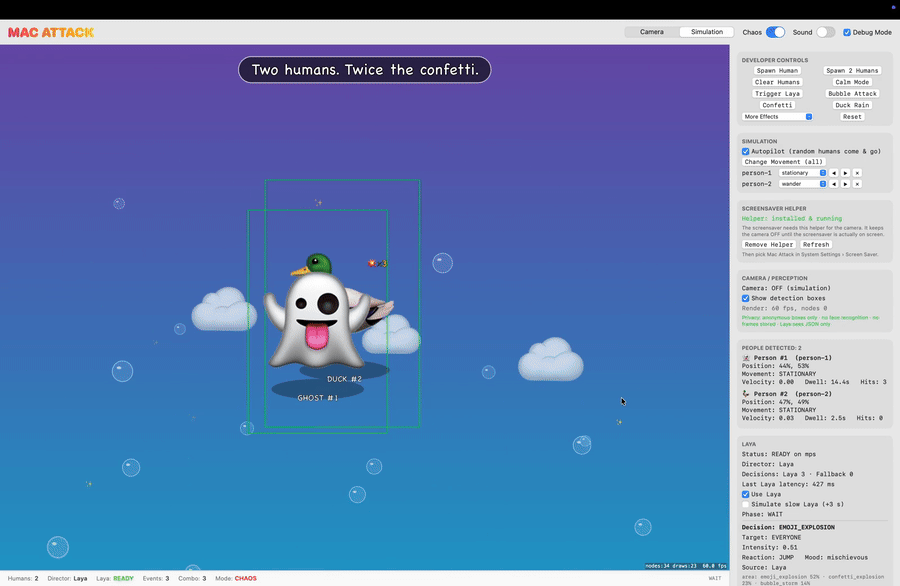

# Mac Attack — Phase 1

A weird little creature that lives in your Mac. The camera watches the room **locally**, people
become anonymous cartoon characters (🐸 🧙 🥔 👽 🦆 🤖 🐱 🦖 👻 🐙), and **Laya** directs harmless toy
chaos at them: bubbles, rubber ducks, tomatoes, balloons, sponges, confetti, rainbows, emoji
bursts, transformations and surprises.



**Videos:** [simulation mode](docs/mac-attack-simulation-demo.mp4) (the game + debug panel + Laya's
decisions) · [screensaver](docs/mac-attack-screensaver-demo.mp4) (a real person, rendered as a
cartoon character — the screensaver never sees the camera image, only anonymous boxes).

```
Camera (AVFoundation ~30fps) → Vision body boxes (~10fps) → PersonTracker → GameEngine (60fps)
                                                                   │  GameSnapshot (JSON only)
                                                                   ▼
                                       DirectorCoordinator → Laya sidecar (127.0.0.1:8777)
                                                          ↘ RandomDirector (local fallback)
                                                                   │  DirectorDecision
                                                                   ▼
                                               GameEvent → SpriteKit renderer → screen
```

> **Unsigned build.** This is signed ad-hoc, so macOS will warn on first launch (right-click → Open)
> and may re-ask for camera permission after each rebuild. Signing with an Apple Developer ID
> removes both.

## Build & run

Requirements: macOS 14+, Swift 6 toolchain (Command Line Tools are enough; Xcode is not needed).

```bash
# one-time: Laya sidecar environment (reuses the cached HF checkpoints in ~/.cache/huggingface)
python3 -m venv LayaDirector/.venv && LayaDirector/.venv/bin/pip install -r LayaDirector/requirements.txt

./scripts/build_app.sh          # → build/MacAttack.app
open build/MacAttack.app        # camera mode
open build/MacAttack.app --args --simulate --debug
./scripts/test.sh               # 24 unit tests (tracker, engine state machine, sampling, fallback, sim)
```

The app starts the Laya sidecar itself (`LayaDirector/run.sh`) and stops it on quit; a watchdog
relaunches it if it dies, and the sidecar exits on its own if the app disappears. You can also run
it manually: `LayaDirector/run.sh` (then the app just connects).

Launch flags: `--simulate`, `--autopilot` (sim + random humans), `--chaos`, `--debug`,
`--no-sound`, `--no-sidecar`, `--slow-laya` (+3 s per decision), `--laya-port N`, `--no-activate`.

## Camera permission

First launch in Camera mode shows the standard macOS prompt ("Mac Attack watches the room
locally…"). If denied, the canvas shows a card with **Open Privacy Settings** and **Use Simulation
Mode**. To change later: System Settings › Privacy & Security › Camera › Mac Attack. To re-test
the prompt: `tccutil reset Camera local.macattack`.

The bundle is ad-hoc signed unless a signing identity exists (`SIGN_IDENTITY=...` or an
"Apple Development" cert is auto-detected). With ad-hoc signing macOS may ask again after a rebuild.

## Modes

- **Camera / Simulation** — segmented control in the header. Simulation replaces the camera with
  fake humans (same `TrackSnapshot`s the tracker produces), so the whole game runs without a camera.
- **Debug Mode** — checkbox in the header. Opens the side panel:
  - Developer controls: Spawn Human, Spawn 2 Humans, Clear Humans, Chaos Mode, Trigger Laya,
    Bubble Attack, Confetti, Duck Rain, More Effects (all 11), Reset. Spawning switches to Simulation.
  - Simulation: autopilot, per-human behavior (wander/stationary/left/right/zigzag/frantic), nudge, remove.
  - Camera/perception: status, device, detection fps/latency, upper-body toggle, face-box assist,
    detection boxes overlay, render fps/node count, start/stop camera.
  - People: position %, movement, velocity, dwell, hits.
  - Laya: health, device, latency, Use Laya / Simulate slow Laya toggles, last decision with the
    top probabilities per question and the exact text Laya read; decision log (Laya vs Local).
- **Chaos** — hotter sampling temperature, shorter cooldowns, fewer dramatic pauses.

## How Laya is integrated

Laya (`pip install laya`, Convai Innovations, HF `convaiinnovations/laya`) is a **non-autoregressive
typed-decision model**: `Router().predict(state, questions)` answers `choice` / `score` / `noul`
questions in one forward pass with calibrated probabilities. It is PyTorch, so it runs in a local
FastAPI sidecar (`LayaDirector/server.py`, 127.0.0.1 only, English checkpoint, MPS on Apple Silicon).

1. The engine builds a `GameSnapshot` (ids, normalized boxes, movement, velocity, dwell time,
   character type, hits, combo, last event, trigger). No pixels, no identity.
2. The sidecar turns it into a one-paragraph situation ("2 humans in view. person-1 is the frog on
   the left, just arrived, moving left…") and asks 8 questions: `style` (projectile/area/transform/
   surprise), `projectile` (5), `area` (4), `target` (visible people + everyone), `intensity` (score),
   `reaction` (8), `hold_back` (noul), `mood` (4).
3. Swift (`LayaDecisionMapper`) **samples** those distributions (T=1, T=1.8 in chaos) instead of
   taking argmax, down-weights repeating the last gag, and scales `hold_back` so doing nothing is an
   occasional pause. Same situation, different outcomes, still following Laya's taste.
4. Decisions are event-driven: on arrival, on departure, after each effect's cooldown (2.5–5 s,
   1–2.2 s in chaos), or on "Trigger Laya". One request in flight, never in the render loop.
5. `DirectorCoordinator` uses Laya only when `/status` is ready and the answer arrives within 2 s;
   otherwise `RandomDirector` decides. The engine also has its own 3 s guard. The UI shows
   `Director: Laya` or `Director: Local Fallback`.

Design notes from measuring the real model: a single 11-option choice falls in Laya's `choice:11+`
temperature bucket, which ships uncalibrated (probabilities saturate to 1.0), so the effect is split
into `style` + a ≤5-option pick. Sending the situation as text instead of the raw JSON halves latency
(~630 ms → ~340 ms on MPS) because Laya re-reads the state once per question.

## Privacy

- Vision `VNDetectHumanRectanglesRequest` → body rectangles only. Optional **face-box assist**
  (`VNDetectFaceRectanglesRequest`, on by default, toggle in Debug) adds a head-and-shoulders box when
  someone sits too close for body detection: rectangles only, no landmarks, no recognition, no
  identity, nothing kept between frames.
- Pixel buffers are processed in the capture callback and released; no file output, no recording,
  no frame persistence, no network except `127.0.0.1` to the sidecar (`HF_HUB_OFFLINE=1`).
- Ids are per-session counters (`person-N`); characters are random per track.
- Camera stops on quit/mode switch; the sidecar is terminated on quit and self-exits if orphaned.

## Project layout

```
Sources/MacAttackCore/   (no AVFoundation/Vision/SpriteKit — reusable for the Phase 2 saver)
  Game/        Models (Person, GameEvent, EffectKind…), GameState + GameSnapshot, GameEngine, Narrator
  Director/    GameDirector, RandomDirector, Sampler, DirectorCoordinator (timeouts/fallback/health)
  Laya/        LayaAdapter (HTTP client + LayaDecisionMapper), LayaSidecar (process lifecycle)
  Perception/  PersonTracker
  Simulation/  SimulationWorld
Sources/MacAttack/
  App/ Camera/ Perception/ (VisionPersonDetector) Rendering/ (GameScene, CharacterNode, FXLayer) Debug/
LayaDirector/  server.py, questions.py, run.sh, requirements.txt
scripts/       build_app.sh, test.sh, soak.sh
Tests/MacAttackCoreTests/
```

## Known limitations

- Laya is a classifier, not a planner: "direction" is question design + sampling. It is noticeably
  opinionated on some questions (e.g. `projectile` strongly prefers duck rain in some situations);
  the anti-repeat weight and chaos temperature keep things varied.
- Laya latency on MPS is ~300–600 ms, up to ~1 s while the camera and Vision are also busy; decisions
  that exceed 2 s fall back locally. First model load takes ~10–40 s (fallback director meanwhile).
- The sidecar needs ~1 GB+ (unified memory) for the English checkpoint.
- Body detection is weak when only a face is visible; face-box assist covers it. Very fast motion
  can briefly swap ids between two people who cross.
- Tracking is 2-D and approximate; approaching/retreating is inferred from box size.
- Ad-hoc signing can re-trigger the camera prompt after rebuilds.
- SwiftUI's `@State` is a macro in the macOS 27 SDK whose plugin ships only with Xcode, so the app
  avoids it; `scripts/test.sh` passes the swift-testing plugin path explicitly for the same reason.

## Phase 2 — the screensaver

Mac Attack is also a real macOS screensaver (System Settings › Screen Saver › Mac Attack).

**Why there are two pieces.** macOS never gives a screensaver camera access: a `.saver` runs inside
Apple's sandboxed `legacyScreenSaver` host, and a camera request there is attributed to that host
and refused without ever prompting (measured, not assumed — see `Sources/MacAttackSaver`). Anything
the saver spawns inherits that sandbox, and `open` is blocked too. So:

```
MacAttack.app --helper        (launchd agent, normal sandbox-free user session)
  ├── camera + Vision         → anonymous person boxes only
  ├── Laya sidecar            → 127.0.0.1:8777
  └── serves 127.0.0.1:8778   → { camera, tracks[ id,x,y,w,h,vx,vy,movement,dwell ] }
                                        │  (no images, ever)
MacAttack.saver               ← polls 10×/s, runs the game engine, renders, asks Laya
```

The helper keeps the camera **off** until the screensaver actually asks for people (a lease), and
switches it off again a few seconds after the screensaver stops. The menu bar item shows which it is.

The screensaver draws the cartoon world only — it cannot show the camera image, because it never
receives one.

### Install (for anyone)

```bash
git clone https://github.com/dockndevai/mac-attack.git && cd mac-attack
python3 -m venv LayaDirector/.venv && LayaDirector/.venv/bin/pip install -r LayaDirector/requirements.txt
./scripts/build_app.sh          # builds build/MacAttack.app
./scripts/build_saver.sh --install   # builds + installs ~/Library/Screen Savers/MacAttack.saver
open build/MacAttack.app        # allow the camera when macOS asks
```

Then:
1. In the app, tick **Debug Mode** → **SCREENSAVER HELPER** → **Install Helper (runs at login)**.
2. System Settings › Screen Saver › **Mac Attack**, and set "Start Screen Saver…" to a few minutes.

The first Laya decision needs the model in `~/.cache/huggingface` (~2.2 GB, downloaded on first run
of the sidecar). Until it is ready the local fallback director runs the game.

To remove: Remove Helper in the app, delete `~/Library/Screen Savers/MacAttack.saver`, and
`launchctl bootout gui/$UID/local.macattack.helper` if it is still loaded.

### What the screensaver cannot do

- No camera image on screen (by design and by sandbox).
- It does not run on the macOS **lock/login screen**: Apple only runs its own screensavers there,
  and there is no user session for the helper before login.
- Ad-hoc signing means a rebuild can invalidate the camera grant; the helper then re-requests it.

## Test results (Phase 1, 2026-09-22, M2 Pro, macOS 27)

- `./scripts/test.sh`: 24/24 pass (tracker enter/leave/flicker/multi-person/motion, engine full loop,
  hold-back, escape→idle, stale target, stuck director→local fallback, transform, 50× enter/leave,
  Laya mapping, sampling, snapshot contains only abstract fields, unreachable Laya→fallback, sim bounds).
- Camera mode (live): permission prompt, preview, Vision detection ~8.5 fps at ~25 ms, person →
  character, Laya READY on MPS directing events.
- Soak `scripts/soak.sh 40` (simulation autopilot + chaos, isolated instance): 40 min, ~2,290 s of
  game time, 455 events (407 Laya / 57 fallback), no crash.
  - Laya killed at 11 min → fallback took over, watchdog relaunched the sidecar, back to Laya.
  - Laya frozen (SIGSTOP) for 60 s at 22 min → decisions timed out to fallback, recovered on thaw.
  - SIGTERM of the app → sidecar self-exited (parent watch); normal quit → camera + sidecar stopped.
  - App CPU avg 13% (max 36%); RSS 56–647 MB, fluctuating with no upward trend (ended at 59 MB);
    live effect nodes stayed ≤ 15. Sidecar ~0–10% CPU between decisions, ~1 GB unified memory.
  - Render fps was ~12 in the soak because its window was occluded (macOS throttles hidden
    windows); visible windows render at 60 fps.
- Not tested automatically: camera-denied flow (needs `tccutil reset Camera local.macattack`) and camera
  unplug. Both paths show a status card with a Simulation fallback.
